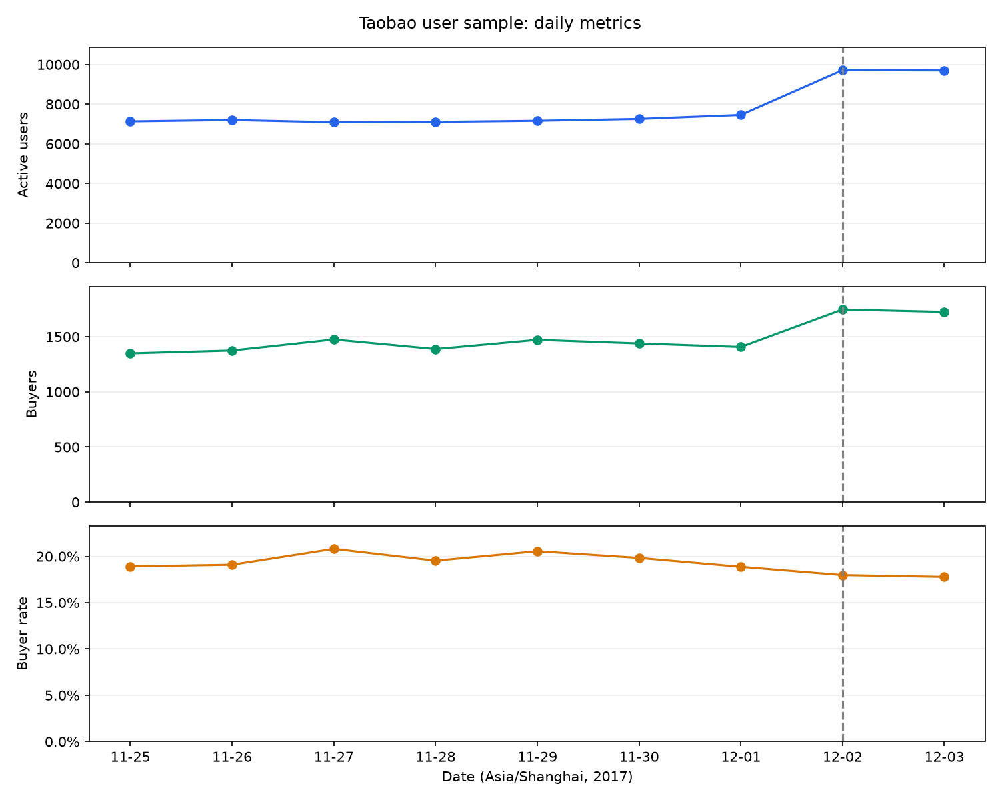

# 淘宝用户行为分析：购买人数变化

**个人公开数据项目 · SQL / DuckDB / Python / pandas / Matplotlib**

本案例研究：2017 年 12 月 2 日样本购买人数的增加，如何对应活跃规模、购买率与两天用户构成的变化？购买行为记录的增量集中在哪些品类？

## 核心发现

窗口内共有 993,560 条行为记录、9,915 位用户。以下日期均为北京时间。

| 指标 | 2017-12-01 | 2017-12-02 | 变化 |
|---|---:|---:|---:|
| 活跃用户 | 7,456 | 9,718 | +2,262，+30.34% |
| 购买用户 | 1,407 | 1,747 | +340，+24.16% |
| 活跃用户购买率 | 18.87% | 17.98% | −0.89 个百分点 |
| 购买行为记录 | 2,096 | 2,605 | +509 |



1. **人数分解：** 购买人数＝活跃人数×购买率。对称分解得到活跃规模项 +416.75、购买率项 −76.75，合计 +340。两项为折算人数，是数量关系。
2. **人群定位：** 仅后一天活跃组 +388、共同活跃组 −9、仅前一天活跃组 −39，合计 +340。分组由两天活跃状态定义，并非新老注册用户分组。
3. **品类分布：** 两天至少一天有购买的 1,345 个品类中，709 个增长、491 个下降、145 个持平。正向增量 1,250、负向变化 −741，净增 509 条。增长前十增加 117 条，占正向增量 9.36%；若以净增量为分母则为 22.99%，两者含义不同。

## 阅读入口

| 文件 | 内容 |
|---|---|
| [业务备忘录](reports/business_memo.md) | 发现、证据、后续调查与限制 |
| [analysis.ipynb](analysis.ipynb) | 实际 Notebook、逐步查询、汇总表与趋势图 |
| [analysis.sql](analysis.sql) | 从已有样本表开始的质量检查、窗口筛选、日指标、人群与品类查询 |
| [prepare_data.py](prepare_data.py) | 从原 CSV 读取五字段并按用户 hash 抽样 |
| [run_analysis.py](run_analysis.py) | 复跑下游 SQL、计算分解、导出聚合 CSV 与趋势图 |
| [数据说明](data/README.md) | 来源、字段、文件位置及下载说明 |
| [outputs](outputs/) | 日指标、人群、品类、质量检查与分解结果 |
| [复现核验](reports/reproduction_checks.md) | 本次迁移实际执行的检查与边界 |

## 数据与方法

来源为[天池淘宝用户购物行为数据集](https://tianchi.aliyun.com/dataset/649)，使用本地 `UserBehavior.csv`。数据是公开样本，不属于拼多多内部业务经历。

- Python 3.12、DuckDB **1.5.5**；五字段以 `VARCHAR` 读取。`hash(user_id) % 100 = 0` 按用户抽取约 1%，保留入选用户的全部可见记录。[DuckDB hash 可能随版本变化](https://duckdb.org/docs/current/sql/functions/utility#hashvalue)，复现固定此版本，不把样本结果直接放大为全平台估计。
- 原样本 **994,112 条**。使用北京时间 **[2017-11-25 00:00, 2017-12-04 00:00)**，排除窗口前 526 条与窗口后 26 条，保留 993,560 条。
- 原样本多出 **1 条五字段完全相同行**，因没有唯一事件编号而保留并披露。没有静默去重。
- 活跃用户：当天出现任意行为的去重用户；购买用户：当天出现 `buy` 的去重用户；购买率：购买用户／活跃用户；购买记录：`buy` 行数。
- 用户组先聚合为一人一行，再按两天活跃状态互斥划分。品类分解使用购买记录数，避免跨品类用户不可加的问题。

对称分解公式：

```text
Δ购买人数 = Δ活跃人数 × 两日购买率均值
           + Δ购买率 × 两日活跃人数均值
```

## 环境与启动目录

从仓库根目录进入案例目录，再执行以下命令。本地仓库根目录可以继续叫 `taobao_analysis`；远程仓库名不同不影响运行。

```bash
cd projects/taobao-user-behavior
python3.12 -m venv .venv
source .venv/bin/activate
python -m pip install -r requirements.txt
python -m ipykernel install --user --name taobao-analysis --display-name "Python (taobao-analysis)"
```

Windows 可使用 `.venv\Scripts\activate` 激活环境。固定的分析包版本见 [requirements.txt](requirements.txt)；Jupyter 辅助工具给出兼容范围。

### 路线 A：从原始 CSV 完整复现

从来源页下载并解压 `UserBehavior.csv`，放在本案例的 `data/` 下。文件无表头。以下两步依次完成读取、用户抽样、时间窗筛选、分析与导出：

```bash
python prepare_data.py --csv data/UserBehavior.csv --db data/taobao.duckdb
python run_analysis.py --db data/taobao.duckdb --output outputs
```

也可从本案例目录运行 `jupyter lab analysis.ipynb`，选择上述环境后从头执行。数据库尚无 `sample_events` 时，Notebook 读取 CSV 并建立样本；已有样本时复用。Notebook 前几个单元检查 CSV 字段，因此始终需要原 CSV；只有下游脚本不需要原 CSV。

`prepare_data.py` 拒绝覆盖现有数据库。需要重新抽样时请指定一个新的 `--db` 文件名；不要删除原数据或现有样本来重复本案例。

### 路线 B：使用已有 taobao.duckdb / sample_events

只需 DuckDB 中已有五列均为 VARCHAR 的 `sample_events`，无需重新读取 CSV。先关闭占用同一数据库的 Notebook 连接（`con.close()`），再运行：

```bash
python run_analysis.py --db data/taobao.duckdb --output outputs
```

原本就在本地 `taobao_analysis` 根目录的 CSV 和数据库不必移动或复制。从案例目录可直接使用：

```bash
python run_analysis.py --db ../../taobao.duckdb --output outputs
```

如果希望 Notebook 也使用原本根目录的数据，可在 macOS / Linux 终端设置相对路径：

```bash
TAOBAO_CSV=../../UserBehavior.csv TAOBAO_DB=../../taobao.duckdb jupyter lab analysis.ipynb
```

确保选用同一 Python 环境。Notebook 会创建或更新 `analysis_events`、`user_two_day` 派生表，并在最后关闭连接。`run_analysis.py` 则以只读方式打开已有数据库，只建立临时派生表；不会修改 `sample_events` 或持久化的其他表。它会覆盖指定输出目录的同名聚合文件，保留其他文件。

`run_analysis.py` **不是**原始 CSV 的读取和抽样入口；空数据库应先走路线 A。两个入口均在不复制原 CSV 的情况下工作，`--csv` 可直接指向已有文件。

## 结论边界

购买行为记录不等于订单，无金额无法计算 GMV。每日均出现 24 个小时的记录只能排除明显的小时空缺，不能证明采集完整。公开数据的用户入选规则、探索性比较日期与人群构成限制了外推。当前证据不能确定促销、推荐或其他业务动作造成了变化。

后续需核查访问／曝光来源、活动与埋点变更及原数据用户入选规则，再区分用户构成和访问目的等解释，决定是否开展实验。
