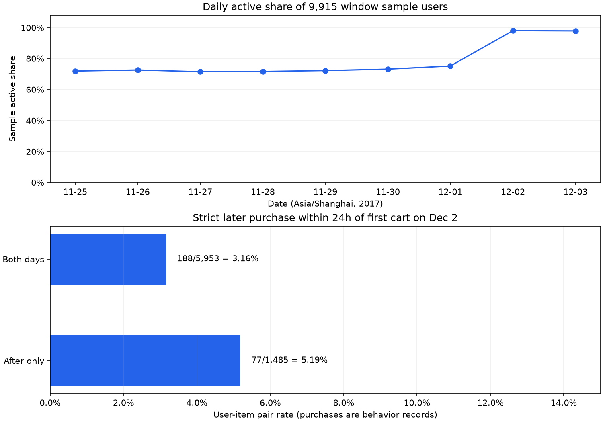

# 购买人数增加后，还需要看什么？

**公开数据个人项目｜北京时间 2017-11-25—12-03｜2017-12-01 → 12-02 为原比较**

12 月 2 日购买用户比前一天增加 340 人，同时活跃用户购买率下降 0.89 个百分点。人数增长主要对应活跃规模扩大，同星期比较也呈现这一方向。贡献 388 位购买用户的 after_only 人群，全部在此前六天出现过；他们的日用户购买率较低，但加购商品对后续购买率较高。因此，现有证据支持继续核查用户构成和购买路径，尚不足以把增长归因于某项策略，或认定这组用户质量较差。

## 数据范围与口径

使用[天池淘宝用户购物行为公开数据](https://tianchi.aliyun.com/dataset/649)的用户 hash 样本。北京时间 `[2017-11-25 00:00, 2017-12-04 00:00)` 内共有 993,560 条行为记录、9,915 位用户，结论只针对这份样本。

购买用户按天去重，购买率的分母是当天活跃用户；购买记录按行为行计数，不等于订单，缺少金额无法计算 GMV。样本中多出的 1 条五字段完全相同行保留。抽样与质量规则见[复现说明](reproduction_checks.md)，查询过程见[Notebook](../analysis.ipynb)。

## 12 月 1 日 → 2 日：活跃规模扩大，购买率下降

12 月 1 日 → 2 日：活跃用户 7,456 → 9,718，购买用户 1,407 → 1,747，购买率 18.87% → 17.98%（−0.89 个百分点），购买记录 2,096 → 2,605。

- 对称分解：活跃规模项 +416.75、购买率项 −76.75，合计 +340。它是“人数＝活跃人数×购买率”的数量分解。
- 两天互斥用户分组：12 月 1 日未活跃、12 月 2 日活跃的 after_only 贡献 +388；两天均活跃的 both_days 为 −9；两天中仅前一天活跃的 before_only 为 −39，合计 +340。
- 1,345 个有购买记录的品类中，709 增长、491 下降、145 持平。正向增量 1,250、负向变化 −741，净增 509。前十增加 117，占正向增量 9.36%，占净增量 22.99%；分母不能互换。

这两种分解回答不同问题：规模与购买率说明总量如何变化，互斥人群说明哪些用户组贡献了净变化。after_only 的贡献超过净增人数，其他两组部分抵消了增长，因此需要继续了解这 2,411 人此前的出现情况。品类前十只占正向增量的 9.36%，增长也并非集中在少数头部品类。

## 同星期参照与样本覆盖

| 比较（北京时间） | 活跃人数：前→后 | 绝对变化／相对变化 | 购买人数：前→后 | 绝对变化／相对变化 | 购买率：前→后 | 变化（百分点） |
| --- | --- | --- | --- | --- | --- | --- |
| 2017-11-25 → 2017-12-02（周六） | 7,132 → 9,718 | +2,586／+36.26% | 1,349 → 1,747 | +398／+29.50% | 18.91% → 17.98% | -0.94 |
| 2017-11-26 → 2017-12-03（周日） | 7,201 → 9,702 | +2,501／+34.73% | 1,375 → 1,725 | +350／+25.45% | 19.09% → 17.78% | -1.31 |
| 2017-12-01 → 2017-12-02（相邻两天） | 7,456 → 9,718 | +2,262／+30.34% | 1,407 → 1,747 | +340／+24.16% | 18.87% → 17.98% | -0.89 |

购买记录的同周六比较为 2,033 → 2,605（+572），同周日为 2,047 → 2,534（+487）。完整聚合结果见 [weekday_comparison.csv](../outputs/weekday_comparison.csv)。

12 月 2 日活跃人数占窗口内全部样本用户的 **98.01%**，12 月 3 日为 **97.85%**；分母均为 9,915 位样本用户。这是样本活跃占比，不是平台渗透率。接近全样本同时活跃，应优先核查源数据的用户入选条件、按天采集范围与导出规则，再讨论真实行为变化。该现象不能单凭日志解释为采集错误。

原比较跨越周五和周六，补充相同星期的日期后，仍能看到人数上升、购买率下降。不过周六、周日各只有两个观察点，九天数据不能建立稳定季节性基线，也不能据此认定周末、促销或推荐策略造成了变化。每日都有 24 个小时的记录，同样不能证明没有漏采。

## after_only 的历史与加购路径

**问题一：在更早窗口内是否出现过？** 只用 11 月 25—30 日的记录判断，不把 12 月 3 日的行为算作历史。

| 11 月 25—30 日是否出现 | 人数 | 12 月 2 日购买人数 | 购买率 | 12 月 2 日加购用户 | 当日人均行为记录 |
| --- | --- | --- | --- | --- | --- |
| 此前窗口内未出现 | 0 | 0 | — | 0 | — |
| 此前窗口内出现过 | 2,411 | 388 | 16.09% | 673 | 10.62 |

两组人数加总为 2,411、购买人数加总为 388，与原 after_only 组一致。此前出现组在 12 月 2 日共有 25,597 条行为，其中 22,773 条浏览、1,499 条加购、592 条购买；详见 [after_only_history.csv](../outputs/after_only_history.csv)。此前未出现组为零，购买率无定义。

这些用户只是 12 月 1 日没有可见行为，并非整个九天窗口内仅在 12 月 2 日活跃。已有记录不能支持“新注册用户”这一解释，九天日志也无法识别长期沉默用户。

**问题二：加购后是否购买同一商品？** 指标为“24小时加购商品对后续购买率”：分母是 12 月 2 日有加购且具有完整 24 小时观察范围的去重用户—商品对；分子是当天首次加购后 24 小时内，同用户购买同商品的对数。重复加购或购买不重复计数，同秒购买单独披露。

| 人群 | 起点商品对 | 排除：观察不足 | 合格商品对 | 严格后续购买对 | 同秒购买对 | 24小时加购商品对后续购买率 |
| --- | --- | --- | --- | --- | --- | --- |
| all | 7,438 | 0 | 7,438 | 265 | 0 | 3.56% |
| after_only | 1,485 | 0 | 1,485 | 77 | 0 | 5.19% |
| both_days | 5,953 | 0 | 5,953 | 188 | 0 | 3.16% |

当前起点在日志窗口内都留有完整 24 小时观察范围，排除数为 0，同秒购买对也为 0。这只说明时间范围足够，不能保证实际采集没有缺失。[cart_to_buy_24h.csv](../outputs/cart_to_buy_24h.csv) 保留完整计数，严格的先后顺序与窗口边界见 Notebook。

after_only 的用户购买率为 16.09%，低于 both_days 的 18.60%；但加购商品对后续购买率为 5.19%，高于 3.16%。两者人群筛选、分母和时间窗不同，不能混用或直接判断人群质量。商品、价格、访问意图与加购时刻也可能不同；这里不把多商品对当作独立用户来做显著性检验。

## 决策与下一步

首先核查样本入选与采集范围，解释为何 12 月 2、3 日接近全样本用户活跃。随后补充商品、访问来源、曝光和策略记录，区分商品构成、购买意图与页面路径等可能解释。

一个可讨论的候选假设是：对近期有行为、前一天未活跃且当前加购的人群，提供已加购商品回访入口，可能帮助其完成后续购买。历史日志没有页面曝光、访问目的或干预记录，无法判断是否存在这项需求。对应的[实验草稿入口](../README.md#后续工作)保留在项目末尾；状态为“方案设计，尚未实施”，实施前仍需同口径基线、业务阈值与可用埋点。
